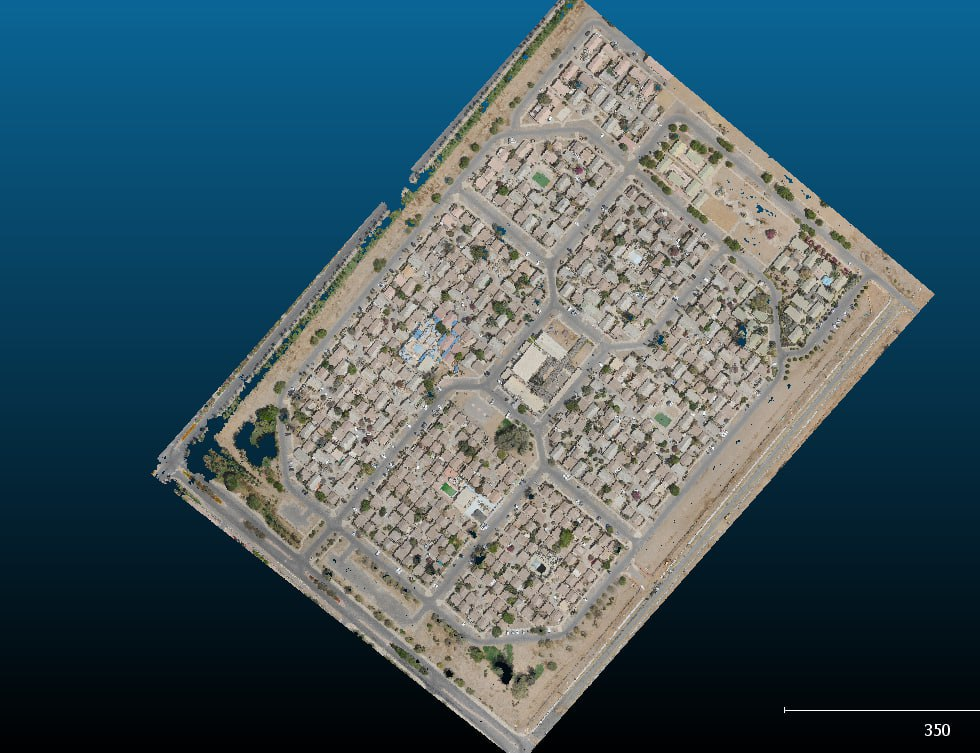

# 3D-Semantic-Segmentation

## Overview
This project focuses on developing expertise in 3D semantic segmentation and object extraction using advanced machine learning techniques. The goal is to design a highly accurate 3D object detection model by leveraging Kernel Point Convolution (KPConv) capabilities within PyTorch, integrating data from LiDAR and 2D imagery, and ensuring rigorous data validation and post-processing.

## Project Details
### Objective
The main objectives of this project are:
1. Develop an innovative 3D object detection model using KPConv within PyTorch.
2. Combine 3D LiDAR data with 2D images to enhance object detection accuracy.
3. Annotate and validate point cloud datasets meticulously using CloudCompare.
4. Pinpoint objects in new datasets and determine their exact geo-coordinates post-model inference.
5. Manage post-processing tasks, including object removal and fine-tuning, to meet project goals.

### Methodology
#### Innovative Model Development
- **Kernel Point Convolution (KPConv)**: Utilized KPConv capabilities within PyTorch to design a tailored 3D object detection model. KPConv enables efficient and accurate 3D convolution operations on point clouds.

#### Data Fusion
- **Combining 3D and 2D Data**: Integrated 3D data from LiDAR with regular 2D images to improve the tool's accuracy in object detection. This fusion enhances the model's ability to understand spatial and visual features.

#### Rigorous Data Validation
- **CloudCompare Software**: Used CloudCompare for meticulous annotation and validation of point cloud datasets. This ensures a robust and accurate foundation for model training and validation.

#### Advanced Extraction
- **Object Detection and Localization**: After model inference, accurately identified objects in new datasets and determined their exact geo-coordinates. This step is crucial for practical applications in various geospatial and mapping projects.

#### Post-Processing Excellence
- **Post-Processing Tasks**: Managed tasks such as removing objects from data and fine-tuning details to meet project goals after the model's initial predictions. This ensures the final output is precise and meets the desired standards.

## Example Usage
### Scenario
A geospatial analyst needs to detect and extract specific objects (e.g., buildings, vehicles, vegetation) in a given area using 3D LiDAR data and 2D images.

**Steps:**
1. **Data Preparation**: Load and preprocess the 3D LiDAR data and 2D images.
2. **Model Application**: Apply the KPConv-based 3D object detection model to the prepared data.
3. **Object Detection**: The model detects and segments the specified objects.
4. **Post-Processing**: Perform post-processing tasks such as removing irrelevant objects and fine-tuning the detected objects.
5. **Validation**: Validate the results using CloudCompare to ensure accuracy.

### Benefits
- **Enhanced Accuracy**: Improved object detection accuracy by combining 3D and 2D data.
- **Efficient Workflows**: Streamlined workflows with advanced model development and post-processing techniques.
- **Robust Validation**: Ensured high-quality data annotation and validation using CloudCompare.

### Running the Model
To use the model:
1. Ensure your environment is set up with the necessary tools (e.g., PyTorch, KPConv, CloudCompare).
2. Load your 3D LiDAR data and 2D images into the specified directories.
3. Run the preprocessing script to prepare the data for model input.
4. Execute the object detection model to identify and segment objects.
5. Perform post-processing tasks as needed to refine the results.
6. Validate the output using CloudCompare for accuracy.
